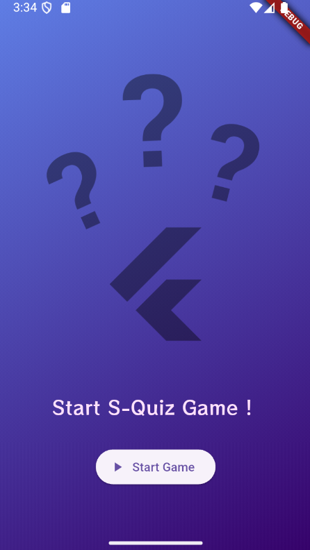
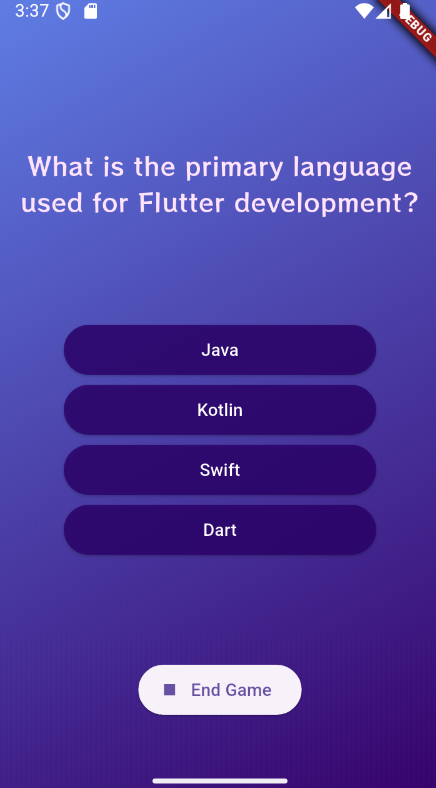
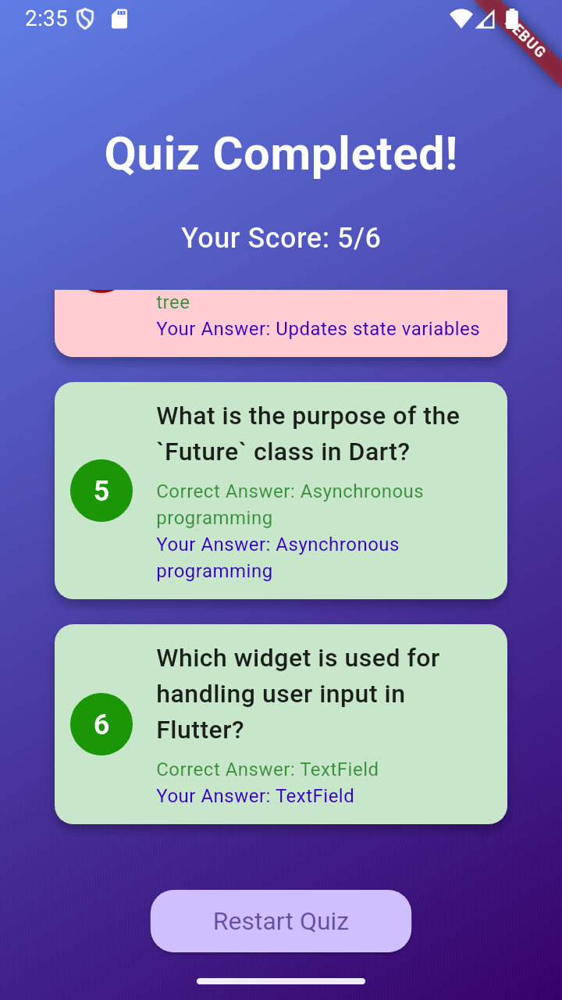

# 🍽️ MealsApp - A Flutter Meals Browser  

MealsApp is a **multi-screen Flutter application** that allows users to **browse meals by category, apply filters**, and view detailed recipes with **ingredients, preparation steps, and tips**. It features **smooth animations** and uses **Riverpod** for state management. Users can also **favorite meals** for quick access.  

## 🚀 Features  
✅ Browse meals by category  
✅ Apply filters (gluten-free, vegetarian, vegan, etc.)  
✅ View detailed meal information  
✅ Add meals to favorites  
✅ Smooth Flutter animations  
✅ State management with Riverpod  

## 📸 Screenshots  
  
  
  


## 🛠 Tech Stack  
- **Flutter** (latest version)  
- **Dart**  
- **Riverpod** (state management)  
- **Material Design**  
- **Animations** (`AnimatedBuilder`, `Hero`, `SlideTransition`, etc.)  

## 🔧 Installation  


1. Clone the repository:
   ```bash
   git clone https://github.com/yourusername/flutter-quiz-app.git


2. Navigate to the project directory:
   ```bash
    cd flutter-quiz-app

3. Install dependencies:
   ```bash
   flutter pub get

4. Run the app:
   ```bash
   flutter run

Make sure you have Flutter and Dart installed before running the app.


##  🎮 Usage 

Launch the app to start the quiz.
Answer each question and view your score at the end.
You can restart the quiz after completing it.
## 📄 License
This project is licensed under the MIT License - see the LICENSE file for details.


## 💖 Acknowledgments 
Flutter for building beautiful UIs.
Google Fonts for typography. """

This project is a starting point for a Flutter application.

A few resources to get you started if this is your first Flutter project:

- [Lab: Write your first Flutter app](https://docs.flutter.dev/get-started/codelab)
- [Cookbook: Useful Flutter samples](https://docs.flutter.dev/cookbook)

For help getting started with Flutter development, view the
[online documentation](https://docs.flutter.dev/), which offers tutorials,
samples, guidance on mobile development, and a full API reference.
